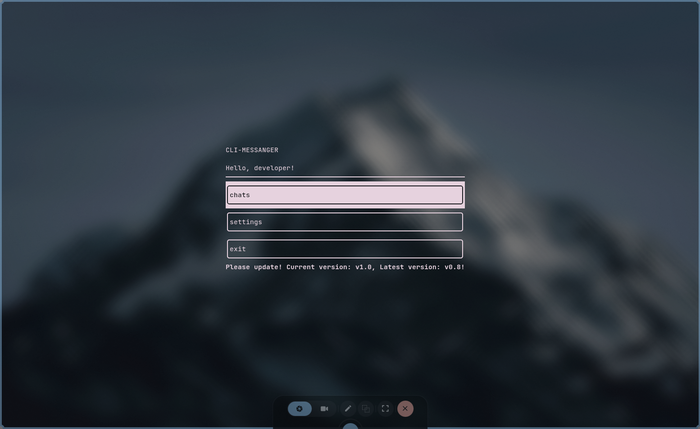
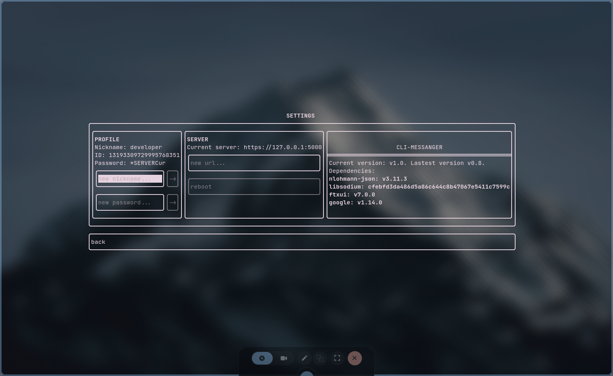
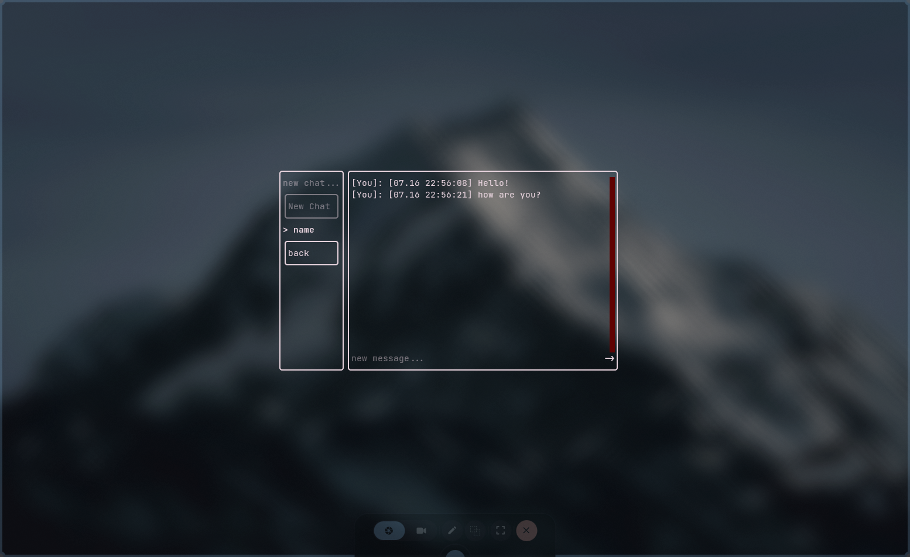

<div align="center">

# CLI Messenger

**A small client-server messenger with a full-screen terminal interface.**


CLI Messenger combines a C++23/FTXUI desktop client with a lightweight Flask server. It is designed for people who enjoy terminal applications and want a simple self-hosted messenger without a browser.

</div>

> [!NOTE]
> now version with custom TCP protocol and E2EE in active development. 

## Screenshots

| Main menu | Settings | Chat |
|---|---|---|
|  |  |  |

## What it can do

- Register and log in with a user-selected numeric ID and password.
- Remember the active server and automatically log in on the next launch.
- Create a chat by another user's ID and exchange text messages.
- Refresh conversations in the background and manually with `/update`.
- Change the nickname, password, or server from the settings screen.
- Export the selected conversation to `client/assets/dump/` with `/dump`.
- Store credentials and the local chat list in an encrypted, machine-bound `save.bin`.
- Log client activity to `client/assets/logs/cli-messanger-session.log`.

The server stores users and messages in `server_state.json`. Passwords are hashed with bcrypt. Message contents are **not end-to-end encrypted**.

## Before you install

You need both parts of the application:

1. A Python server that is reachable over HTTPS.
2. The terminal client built from this repository.

The first CMake configuration downloads FTXUI, nlohmann/json, libsodium-cmake, and, when tests are enabled, GoogleTest. An internet connection is therefore required for the initial build. libcurl must be supplied by the operating system or vcpkg.

> [!IMPORTANT]
> The bundled Flask server and its self-signed certificate are suitable for local networks, demonstrations, and development. The client currently disables TLS certificate verification. Do not expose this setup directly to the public internet or treat it as a production-secure messenger.

## Install the client

### Ubuntu and Debian

Install the compiler, CMake, Git, and libcurl headers:

```bash
sudo apt update
sudo apt install build-essential cmake git pkg-config libcurl4-openssl-dev
```

Build and run:

```bash
git clone https://github.com/ra1zzzengpt/cli-messanger.git
cd cli-messanger
cmake -S . -B build -DCMAKE_BUILD_TYPE=Release -DBUILD_TESTS=OFF
cmake --build build --parallel
cd build
./client/cli_messanger
```

### Arch Linux and Manjaro

```bash
sudo pacman -S --needed base-devel cmake git curl
git clone https://github.com/ra1zzzengpt/cli-messanger.git
cd cli-messanger
cmake -S . -B build -DCMAKE_BUILD_TYPE=Release -DBUILD_TESTS=OFF
cmake --build build --parallel
cd build
./client/cli_messanger
```

### macOS

Install the Xcode command-line tools and Homebrew dependencies:

```bash
xcode-select --install
brew install cmake git curl
```

Then build the application. The explicit prefix helps CMake find Homebrew's curl instead of the system copy:

```bash
git clone https://github.com/ra1zzzengpt/cli-messanger.git
cd cli-messanger
cmake -S . -B build -DCMAKE_BUILD_TYPE=Release -DBUILD_TESTS=OFF \
  -DCMAKE_PREFIX_PATH="$(brew --prefix curl)"
cmake --build build --parallel
cd build
./client/cli_messanger
```

On Apple Silicon, Homebrew normally uses `/opt/homebrew`; on Intel Macs it normally uses `/usr/local`. `brew --prefix` handles both layouts.

### Windows 10/11

The recommended native build uses Visual Studio 2022 and vcpkg.

1. Install [Visual Studio 2022](https://visualstudio.microsoft.com/vs/community/) with **Desktop development with C++**, including CMake and a recent Windows SDK.
2. Install [Git](https://git-scm.com/download/win).
3. Open **Developer PowerShell for VS 2022** and install vcpkg:

```powershell
git clone https://github.com/microsoft/vcpkg.git C:\vcpkg
C:\vcpkg\bootstrap-vcpkg.bat
$env:VCPKG_ROOT = "C:\vcpkg"
```

4. Clone, configure, and build CLI Messenger:

```powershell
git clone https://github.com/ra1zzzengpt/cli-messanger.git
cd cli-messanger
cmake -S . -B build -A x64 `
  -DCMAKE_TOOLCHAIN_FILE="$env:VCPKG_ROOT\scripts\buildsystems\vcpkg.cmake" `
  -DBUILD_TESTS=OFF
cmake --build build --config Release --parallel
cd build
.\client\Release\cli_messanger.exe
```

Keep the terminal window reasonably large; the full-screen interface works best in Windows Terminal.

## Run the server

The server requires Python 3.10 or newer, Flask, bcrypt, OpenSSL, and a TLS certificate. Commands below create an isolated virtual environment and a self-signed certificate.

### Linux and macOS

Install Python and OpenSSL if they are not already available:

```bash
# Ubuntu/Debian
sudo apt install python3 python3-venv openssl

# Arch Linux
sudo pacman -S python openssl

# macOS
brew install python openssl
```

From the repository root:

```bash
cd server/python-server
python3 -m venv .venv
source .venv/bin/activate
python -m pip install --upgrade pip
python -m pip install flask bcrypt
openssl req -x509 -newkey rsa:4096 -nodes \
  -keyout key.pem -out cert.pem -days 365 -subj "/CN=localhost"
python server.py
```

### Windows

Install Python 3.10+ from [python.org](https://www.python.org/downloads/windows/) and OpenSSL, for example with `winget install ShiningLight.OpenSSL.Light`. Then use PowerShell:

```powershell
cd server\python-server
py -3 -m venv .venv
.\.venv\Scripts\Activate.ps1
python -m pip install --upgrade pip
python -m pip install flask bcrypt
openssl req -x509 -newkey rsa:4096 -nodes `
  -keyout key.pem -out cert.pem -days 365 -subj "/CN=localhost"
python server.py
```

The server listens on `https://0.0.0.0:5000`. Use `https://127.0.0.1:5000` in the client when both programs run on the same computer. From another device, use the server computer's LAN address, allow TCP port `5000` through the firewall, and keep the server terminal open.

`server_state.json`, `cert.pem`, and `key.pem` are created or placed in `server/python-server/`. Back up `server_state.json` if you want to preserve accounts and conversations.

## First launch

1. Start the server.
2. Start the client from the `build` directory as shown above.
3. Enter the server URL, including `https://` and port `5000`.
4. Choose **registration**, then enter a positive numeric ID, nickname, and a password of at least four characters.
5. Open **chats**, enter another registered user's ID, and create a chat.
6. Select the chat, enter a message, and press the send button.

The following chat commands are available:

| Command | Action |
|---|---|
| `/update` | Refresh the current conversation immediately. |
| `/dump` | Export the current conversation to a text file. |
| `/quit` | Exit the application. |

Mouse input is supported by FTXUI, but the interface can also be navigated with the keyboard using `Tab`, arrow keys, `Enter`, and normal text input.

## Data and privacy

- The local configuration contains the server URL, account credentials, and chat list. It is encrypted with libsodium and bound to the current machine, so moving `save.bin` to another computer will not make it usable there.
- Deleting `client/assets/save/save.bin` resets the local client configuration. It does not delete the server account or messages.
- The server hashes passwords with bcrypt, but stores message text in plaintext JSON.
- Authentication is password-based on each protected request; there are no session tokens yet.

## Troubleshooting

**CMake cannot find CURL**

Install the libcurl development package for your platform. On Windows, make sure the vcpkg toolchain option is present during the first CMake configure. On macOS, pass the Homebrew curl prefix shown above.

**The client cannot find `client/assets` or cannot create `save.bin`**

Run the executable while the current directory is the repository's `build` directory. The v1.0 client still uses repository-relative runtime assets.

**The server reports that `cert.pem` or `key.pem` is missing**

Generate both files from inside `server/python-server/` and start `server.py` from that same directory.

**The client reports `connection failed`**

Check that the URL starts with `https://`, the server is running, port `5000` is reachable, and the firewall allows the connection.

**Login succeeds but user data cannot be loaded**

Update and restart both the client and server. Their JSON response formats must come from the same project version.

## Build tests

```bash
cmake -S . -B build -DCMAKE_BUILD_TYPE=Debug -DBUILD_TESTS=ON
cmake --build build --parallel
ctest --test-dir build --output-on-failure
```

Developer architecture, coding conventions, API details, and contribution workflow are documented in [CONTRIBUTING.md](CONTRIBUTING.md).

## License

CLI Messenger is distributed under the [GNU Affero General Public License v3.0](LICENCE.md).
